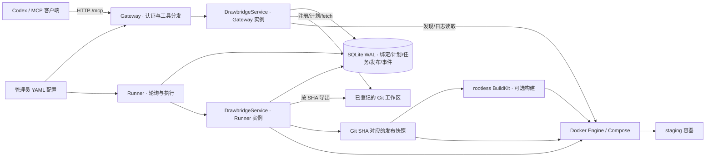

# 当前系统架构

本文描述仓库**当前代码**，供修改前快速定位。更完整的目标设计见
[TECHNICAL_DESIGN.md](../../docs/TECHNICAL_DESIGN.md)；当两者有差异时，以源码、测试和
本次实际验证为准。

## 系统边界

Drawbridge 将受控的部署和观测能力提供给 MCP 客户端。外部调用者可以注册获准目录中的
Git/Compose 项目、计划和排队发布、查询状态与日志，以及执行受限的配置修改和 HTTP
检查。它不提供任意 Shell、任意 Docker 命令或任意 Git URL。当前只支持 `staging`。

Gateway 和 Runner 是两个 Python 进程，各自创建 `DrawbridgeService`，通过同一
`state_dir/state.db` 协作，不相互发 HTTP 请求。**当前代码**在 Gateway 中直接执行
注册、Git 查询和发布计划，因此 `fetch` 模式需要 Gateway 能写登记仓库并访问 origin；
Docker 发现和日志读取也在 Gateway 中调用 Docker。Runner 负责队列任务、发布快照、
构建和 Compose 更新。这与[运维文档](../../docs/OPERATIONS.md)期望的更严格进程权限分离
有差距，部署权限应按实际调用路径核对。

每个 `Database` 实例复用一条 aiosqlite 连接，并用统一的进程内异步锁保护全部数据库
API；多语句状态转换在锁内使用短 `BEGIN IMMEDIATE` 事务。Gateway 与 Runner 的独立连接
仍由 SQLite WAL、busy timeout 和写事务协调。Gateway 只在 ASGI 应用启动时初始化 schema，
关闭时释放连接，不在每次 MCP 工具调用中执行初始化。

## 源码地图

| 模块 | 当前职责 |
| --- | --- |
| [`gateway.py`](../../src/drawbridge/gateway.py) | 创建 Streamable HTTP MCP 工具；按客户端网段、Host、Origin、bearer token 限制入口。 |
| [`config.py`](../../src/drawbridge/config.py)、[`models.py`](../../src/drawbridge/models.py) | 解析严格 YAML 配置、校验工具输入与项目路径。 |
| [`service.py`](../../src/drawbridge/service.py) | 注册、计划、入队、任务执行、发布、回滚、诊断的主要流程。 |
| [`storage.py`](../../src/drawbridge/storage.py) | SQLite WAL 中的应用绑定、计划、任务队列、workspace revision、release 和事件。 |
| [`runner.py`](../../src/drawbridge/runner.py) | 从共享数据库认领任务并调用 `service.run_one_job()`。 |
| [`gitops.py`](../../src/drawbridge/gitops.py) | 校验固定 origin/ref，按 SHA 导出源码快照。 |
| [`compose.py`](../../src/drawbridge/compose.py)、[`build.py`](../../src/drawbridge/build.py) | 校验 Compose 和登记的构建目标；构建、导入并识别镜像。 |
| [`process.py`](../../src/drawbridge/process.py)、[`httpverify.py`](../../src/drawbridge/httpverify.py) | 受限进程执行与出站 HTTP 验证。 |
| [`selfcheck.py`](../../src/drawbridge/selfcheck.py) | 检查 Python、工具、状态目录、SQLite 和 BuildKit 配置条件。 |

## 发布数据流

面向 MCP 调用者的参数顺序和失败处理见[系统发布路径](RELEASE_FLOW.md)。

1. **注册**：`ops_app_register` 接受管理员 `allowed_project_roots` 内已存在的绝对目录、
   项目内的 Compose 文件和已登记的构建 profile。服务端拒绝符号链接路径、无效 Git
   origin、不支持的 Compose 特权键和未登记的构建选项。注册成功才会保存应用绑定。
2. **计划**：`ops_release_plan` 在绑定的仓库中以 `fetch` 或 `local` 模式解析完整 Git ref
   或允许的 SHA，从该 SHA 的 archive 创建临时快照，应用显式选择的 workspace revision，
   再校验 Compose、build 声明和固定服务集合。计划冻结规范化 Compose/build/revision 指纹、
   binding 配置白名单摘要、完整 build profile 摘要和当前发布基线。计划有 15 分钟有效期；
   临时快照在返回前清理，这里不构建或部署。
3. **排队**：`ops_release_apply(plan_id, idempotency_key)` 检查计划及基线，将部署任务写入
   SQLite，返回 `job_id`。当前配置将同时运行的变更任务限定为一个。工具结果中的
   `status: ok` 只表示已接受；客户端需轮询
   `ops_release_status(job_id)` 才能知道任务结果。
4. **执行**：Runner 从队列认领任务，先复验 plan schema、binding 配置、build profile 和
   当前基线，再按冻结 SHA 用 `git archive` 创建发布快照并应用显式 revision。Runner 使用
   与计划阶段相同的原语重新计算全部快照指纹；任一字段不一致都在构建、Compose 或 simulation
   release 写入前以 `STALE_PLAN` 终止。
5. **构建与部署**：simulation 只写发布证据。Docker 模式对 `build:` 服务调用固定的
   BuildKit profile，导出 Docker archive，导入 Docker Engine，查验镜像 ID，生成引用
   镜像 ID 的运行时 Compose，然后执行带 `--detach`、`--no-build`、`--pull never` 和
   `--wait` 参数的 `docker compose up`，再执行配置的健康检查。仅使用现成 `image:` 的
   服务跳过构建。
6. **记录**：任务状态、release、事件和构建制品信息存入 SQLite 或发布目录；通过
   `ops_status`、`ops_logs`、`ops_http_request` 获取后续运行证据。

涉及的核心对象：**binding** 记录应用、环境、仓库、Compose、服务和 profile；**plan**
冻结一次部署输入；**job** 是异步执行实例；**release** 保存成功发布的源码与运行证据；
**workspace revision** 只覆盖事先登记的可编辑文件。

## 安全不变量

- Gateway 的网段、Host、Origin 和 token 检查位于 MCP 工具之前；直连时必须同时配置
  监听地址、`allowed_client_cidrs`、`auth.allowed_hosts` 和防火墙。
- 项目只能从 `allowed_project_roots` 接入；这限制可注册路径，不赋予 Linux 文件权限。
  Compose 的 host namespace、服务级 `devices`、`cap_add` 等入口被拒绝；`privileged`、发布
  端口、GPU device reservation 和绝对宿主挂载只有与管理员 `runtime_profile` 精确匹配才允许。
  管理员可在专用 profile 中批准旧项目 Compose 文件的 SHA-256；只有摘要精确匹配时才扩大
  该文件可声明的运行时权限。可选的 `prefer_prebuilt_images` 会让同时含 `image`/`build` 的
  服务只使用现有镜像，并在摘要不匹配时直接拒绝；未设置该选项时才恢复严格校验。
- 构建仅接受与管理员 profile 匹配的 `context` 和 `dockerfile`。自定义 frontend、
  build args、secret、SSH 和额外 context 不由 Compose 自行指定。代码要求 BuildKit
  使用本机 Unix socket；只有 Runner 执行镜像导入和 Compose 更新。
- 计划阶段和 Runner 使用同一套快照准备与指纹计算原语。计划只能从冻结 SHA 和显式
  revision 生成；旧 schema、服务拓扑变化或任一冻结指纹不一致时必须返回 `STALE_PLAN`，
  并在 BuildKit、Docker、simulation release 等外部副作用前停止。
- 队列容量检查、幂等键与 job 插入位于同一事务；job 认领以条件更新保证唯一。成功部署或
  simulation 回滚的 release、成功事件和 job 终态也在一个事务提交。Git、BuildKit、Docker
  和 HTTP 等外部操作不在 SQLite 事务中执行。
- HTTP 检查有目标 CIDR、端口、方法及响应大小限制；读请求可直接返回，写请求入队。
  诊断输出和日志有边界与脱敏处理。
- 本地 `config.example.yaml` 开启 simulation；真实 Docker 构建与部署需要独立的服务器
  配置和验收。[验证说明](../validation/README.md)解释本地证据的覆盖范围。

## 当前实现与目标设计的差距

- `ops_release_rollback` 当前能完成 simulation release 的显式回滚；Docker release 的
  回滚会返回 `ROLLBACK_PRECHECK_FAILED`。部署失败后的自动回滚也尚未在当前执行流程中实现。
- Docker Compose 更新一旦开始而失败，当前代码保留 release 制品供人工检查；不要把
  失败响应理解为容器已经恢复到上一版本。
- NPU/GPU 宿主能力可通过管理员 `runtime_profile` 精确授权，但真实驱动、设备权限和业务
  健康仍须在对应硬件服务器单独验收；本地或 NVIDIA 主机的 parser 通过不能证明 Ascend 可运行。
- 当前 Gateway 会触达 Git 工作区和 Docker 只读接口；仅靠进程隔离尚不能实现设计文档
  描述的“Gateway 无 Git 凭据、无 Docker socket”目标。若按目标权限严格部署，部分
  工具会失败；需要调整调用架构后再收紧权限，而不是直接授予 Gateway 广泛 Docker 权限。
- `self-check` 检查 BuildKit 工具和 socket 是否存在，不验证 daemon 确实以 rootless
  模式运行；该属性需要在服务器上单独确认。
- Runner 中断后的租约恢复、Docker 失败后的自动回滚以及 HTTP 验证的 DNS 重绑定防护仍待
  后续任务完善。
- t4 已验证 ContractLens 使用现有镜像的 Docker 发布和业务健康检查，但没有执行 BuildKit
  构建，也不证明上述回滚、中断恢复、权限隔离或其他业务项目已经通过验收。
