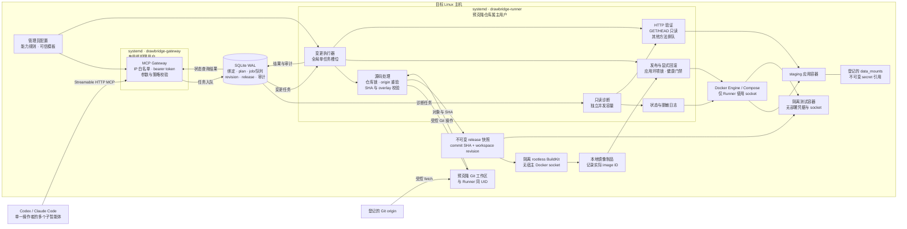
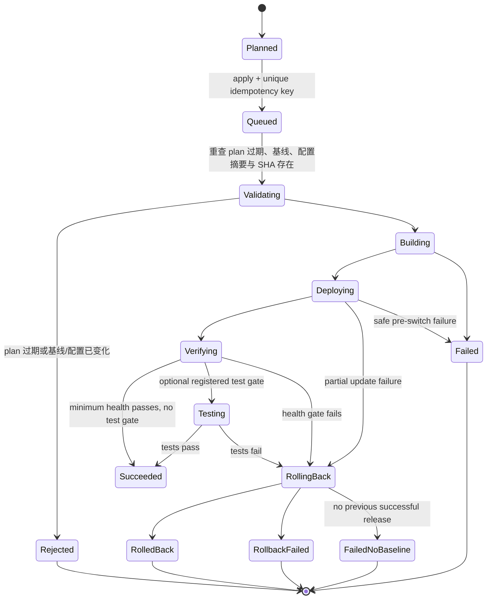

# Drawbridge：面向编程智能体的远程部署与运行观测 MCP

**Drawbridge — MCP bridge for server operations and deployment.**

面向 AI 编程工具的服务器操作与部署桥梁。Drawbridge 意为“吊桥”，连接编程智能体与
目标服务器，通过操作白名单和流程模板控制可执行的动作。它定位为轻量代理工具，
帮助完成部署、观测与验证闭环。项目名使用 `drawbridge`，文档与产品展示使用 `Drawbridge`。

## 1. 结论与设计决策

建设一个部署在目标服务器上的 **Drawbridge**。它通过 **HTTP** 暴露一个
Streamable HTTP MCP 端点；监听地址由部署配置决定，并以客户端源 IP 白名单
（192.168.0.0/16）和默认启用的 bearer token 限制访问来源，让 Codex、Claude Code 等
MCP 客户端能够：

- 获取服务器与应用的受限运行快照；
- 查询已经脱敏、分页的应用日志；
- 将**登记过的仓库**的指定 Git ref 解析为不可变 commit；
- 对测试环境执行可追踪的部署、冒烟测试和回滚；
- 通过服务器内置流程模板完成构建、部署、验证与回滚，不依赖外部 CI/CD。

最重要的决定：**不提供任意 Shell、任意 Docker 命令、任意 Git URL 或任意
文件路径作为 MCP 工具。** MCP 调用者包含语言模型；把这些能力直接暴露，等价于
给模型一个高权限远程执行入口。Drawbridge 的外部 interface 是一小组“任务型”工具，
把 Git、容器编排、健康检查、日志分页、授权和审计隐藏在深的 Deployment Module 中。

对于“把刚由 Codex/Claude Code 修改的代码尽快部署测试”，推荐的主路径是：

1. 智能体在开发机修改代码并推送一个临时分支或 commit；
2. 调用 `ops_release_plan`，服务器只从 app registry 中匹配的 `origin` 拉取该 ref；
3. 调用 `ops_release_apply` 将该不可变 SHA 部署至 staging；
4. 智能体查询 `ops_status` 和 `ops_logs`，按需执行 HTTP 检查或登记测试，解释验证证据；
5. AI 根据验证证据调整代码，生成新 commit，再次触发同一流程模板。

对于需要调整 staging 应用配置的场景，智能体可以对 project binding 中登记的
`editable` 配置文件调用 `ops_workspace_patch`；新 revision 链明确指定待发布的
`base_commit_sha`，服务端返回 diff 和 workspace revision，
之后仍需在 release plan 中冻结该 revision，不能直接构建当前可变工作区。

服务器负责步骤排序、超时、锁与失败恢复；AI 触发流程并解释结果。每次发布冻结完整
SHA 与 workspace revision，不直接发布变化中的未提交工作区；登记的 patch 只能作为冻结
overlay 进入 release 快照。预先克隆的服务器仓库可登记后复用，支持 fetch 后解析 ref
或直接选择本地已提交 SHA。任意源码编辑、任意文件写入和通用终端不属于首版 interface；
仅允许前述登记文件别名的受控配置 patch。

## 2. 目标、边界与假设

### 目标

- 统一给 Codex 和 Claude Code 一个远程 MCP endpoint；
- 覆盖 Linux 主机、Docker Compose 应用的状态、日志与部署；
- 每次变更可定位到请求、工具、应用、commit、镜像、时间和结果；身份后续接入；
- 失败时停止并尝试恢复上一成功 release，如实记录恢复失败；
- 首个版本能在单台 staging 服务器上可靠运行，后续可扩展到多环境。

### 非目标

- 不是通用 SSH 跳板机、终端代理或任意代码执行平台；
- 不建设通用 CI 平台，但承担当前应用的固定构建、部署和测试流水线；
- 不存储业务密钥，也不让 MCP 客户端读取 `.env`、容器环境变量或完整日志归档；
- 第一阶段不支持 Kubernetes、多租户、数据库迁移或数据恢复。

### 设计假设

- 目标服务器为 Linux，应用初期使用 Docker Compose；
- GitHub/GitLab 仓库由操作者预先克隆至服务器，登记固定 source workspace/repo_path；
  Runner 以拥有该仓库的普通 Linux 用户运行并直接 fetch，不额外维护 Runner 专属 mirror。
  使用场景为单一操作者与多个子智能体，不依赖人类和 Runner 同时操作仓库；多个子智能体
  的 Git 操作仍通过仓库锁串行化；
- 使用 HTTP，监听地址和端口可配置；首版由 Gateway 实施客户端源 IP 白名单（仅允许
  192.168.0.0/16 网段访问）并默认启用 bearer token；完整身份权限体系与审批后续决定，
  不作为首版前提；
- 当前不涉及数据库操作；回滚范围限于应用镜像与部署配置。

## 3. 总体架构



Drawbridge 自身是两个 systemd 服务；业务应用由 Docker Compose 管理。Gateway 不接触
Git 凭据或 Docker socket。Runner 从持久化队列认领任务：部署、回滚、重启、patch、测试
及非 GET/HEAD HTTP 验证等变更共用一个运行槽位；只读诊断和 GET/HEAD 走独立容量。
发布使用冻结的 commit SHA 与完整 workspace overlay 创建快照，经隔离构建、镜像导入
和 Compose 更新后执行健康门禁。显式回滚复用保留的历史制品，不重新构建源码；
data_mounts 和外部副作用不随代码回滚。

### 部署形态

- `drawbridge-gateway`：绑定配置的 HTTP 地址（例如 `http://192.168.18.7:8787/mcp`）；
  首版不依赖反向代理、证书或 HTTPS；按配置的客户端源 IP 白名单（默认
  192.168.0.0/16）拒绝白名单外的来源，并默认要求 bearer token（见 §8）。
- Gateway 本身为无状态 Python Module，采用官方 MCP Python SDK 的
  Streamable HTTP transport；只做认证、校验、策略判断和排队，**不**持有 Docker
  socket 或 Git 凭据。
- `drawbridge-runner`：同机 systemd 服务，消费 job。它是唯一可接触部署目录、受控
  本地 Git 仓库与运行时的 deployment principal。Runner 使用该仓库属主的普通 Linux
  用户运行；Gateway 使用不同的专用用户。两者不以 root 身份运行。仓库文件保持同一
  UID，Runner 的 Docker 权限仅用于受控部署，不赋予 Gateway。
- SQLite：本地文件 `/var/lib/drawbridge/state.db` 保存配置快照、release、workspace revision、
  job、步骤、幂等键和事件；无需独立数据库服务。管理员能力策略来自 YAML，用户接入的目录绑定
  保存在 SQLite，不能借接入修改命令、权限或执行 profile。
- 可选 Prometheus：Drawbridge 先读取 node_exporter/cAdvisor 或应用 `/metrics` 的
  聚合结果。它不是 Prometheus 的替代品。

不要把 Gateway 加进 `docker` group。Docker socket 等价于主机高权限；若 staging 的
Runner 必须操作 Docker，可让**仅 Runner**持有该权限，并将它视为受控的部署主体。
Runner 属于可信计算基础，不承诺其无法读取主机 secret。构建/测试代码不能在 Runner
账号下直接执行；使用独立隔离构建环境（例如 rootless BuildKit）与测试容器，不提供
部署凭据或宿主机 Docker socket，并限制资源、磁盘、网络和时间。镜像通过受控制品
导入步骤进入目标 Engine。容器隔离不等于虚拟机级隔离。

## 4. 深模块与内部 seam

外部只有一个 `Drawbridge MCP Module`；调用方不需要知道 Docker、Git worktree、
数据库或 systemd 的细节。其内部保留以下可替换 seam：

| Module | 对上层的 interface | 可替换 adapter | 责任 |
|---|---|---|---|
| Policy Module | `authorize(identity, action, target)` | 本地 RBAC，后续 OPA | scope、环境和应用级授权 |
| Source Module | `resolve(app, ref) -> commit` | 预登记本地 Git 仓库 | 固定 origin、ref 校验、干净源码快照 |
| Runtime Module | `inspect/deploy/restart/rollback/logs` | Compose，systemd，后续 Kubernetes | 将运行时细节收敛在服务器端 |
| Observation Module | `snapshot/queryLogs` | Docker+journal，Prometheus/Loki | 限制数据量、红线脱敏与 cursor |
| Release Module | `plan/apply/status/rollback` | 使用上述 modules | 状态机、幂等、锁、健康门禁与审计 |

Runtime Module 首版可以只有 Compose adapter；在真正需要 Kubernetes 前不引入一层
“通用基础设施 interface”。两个以上 adapter 才证明这条 seam 有现实价值。

## 5. MCP 外部 interface

动态数据通过 tools 返回；resources 只暴露低频、无敏感信息的说明与清单，例如
`drawbridge://environments`、`drawbridge://apps`、`drawbridge://runbook/{app}`。

| 工具 | 权限 | 输入（均有 JSON Schema） | 结果 |
|---|---|---|---|
| `ops_status` | `ops:read` | `environment`, 可选 `app` | CPU/内存/磁盘、服务健康、当前 release、关键端口；不含进程命令行和 secrets |
| `ops_logs` | `logs:read` | `environment`, `app`, `service`（登记名称）, 可选 `since_seconds`, `query`, `cursor`, `limit<=200`（默认 100） | 脱敏日志行、下一 cursor、截断标记 |
| `ops_release_plan` | 后续 `deploy:plan` | `environment`, `app`, `source_mode=fetch/local`, `git_ref`, 可选 `workspace_revision`, `workflow` | 完整 SHA、冻结 revision、基线、配置摘要、影响服务、步骤、plan_id 和过期时间 |
| `ops_release_apply` | 后续部署权限 | `plan_id`, `idempotency_key` | 异步 `job_id`；不会接受命令字符串 |
| `ops_release_status` | `ops:read` | `job_id` 或 `release_id` | 阶段、结构化进度、健康结果、可安全展示的错误 |
| `ops_test` | 后续 `test:run` | `release_id`, `suite`（登记名称）, `idempotency_key` | 测试 job 与证据；核实目标版本并取得环境锁 |
| `ops_service_restart` | `runtime:restart` | `environment`, `app`, `service`（登记名称）, `reason`, `idempotency_key` | 重启当前 release 的已登记服务，随后执行对应健康检查 |
| `ops_release_rollback` | `deploy:rollback` | `environment`, `app`, `release_id`, `reason`, `idempotency_key` | 独立内置回滚 job；只能选择历史成功 release，详见 §7 |

新增核心工具：

| 工具 | 输入 | 结果 |
|---|---|---|
| `ops_catalog` | 可选 app | 可用操作、模板与参数 schema |
| `ops_operation_run` | operation、app/environment、parameters、写操作的 idempotency_key | 公开操作的受限结果或 job_id |
| `ops_workflow_run` | workflow、plan_id 或模板声明的目标参数、idempotency_key | 持久化异步 job_id |
| `ops_app_discover` | limit、cursor | Docker 项目/目录候选，不自动接管 |
| `ops_app_register` | app、project_dir、compose_file、登记 profile、idempotency_key | 校验目录/Compose、自动解析服务，生成应用绑定 |
| `ops_app_adopt_plan/apply` | app；apply 使用 plan_id、reason、idempotency_key | 已有项目必须明确确认，冻结可恢复基线后接管 |
| `ops_workspace_patch` | app/environment、file_alias、patch、expected_revision、idempotency_key；开启新链时还需 `base_commit_sha` | 仅修改绑定中登记的应用配置文件，校验后生成不可变 workspace revision；不接受任意路径或文件内容执行 |
| `ops_http_request` | url、method、headers、body、受限 timeout、可选 app/release_id，写方法另需 idempotency_key | 授权内网 CIDR/端口内 HTTP 验证；GET/HEAD 返回受限证据，其他方法进入统一变更队列并返回 job_id，与 operation http_request 同一路径 |

上表权限列是后续授权接入点，不是首版前提。`ops_release_apply` 是 deploy_basic 模板的
便捷入口，与 ops_workflow_run 使用同一执行器。部署模板必须引用 plan，不允许请求
覆盖 SHA、步骤、命令、路径或环境变量。客户端断开不取消 job，AI 查询 status 获取结果。

`git_ref` 不是 URL；仓库由 app ID 解析，ref 必须通过注册表的正则及 Git 格式校验。
完整 SHA 还必须可从允许的分支/tag 到达，不能仅检查十六进制格式就允许部署。
工具结果的日志与错误须以
`next_cursor` 分页，单次限制在约 200 行/256 KiB，避免撑爆模型上下文，也降低 secret
泄露面。

### 明确拒绝的工具

- `shell(command)`、`ssh(host, command)`、`docker(args)`、`git(url, ref)`；
- 读取任意路径、列出环境变量、下载整个日志文件、端口转发；
- `deploy(branch)` 这种没有先解析并展示 commit/执行计划的捷径；
- 以“测试”为名执行调用者提供的测试命令。测试只能选择已登记的 test suite。
- 任意路径的文件写入、任意源码覆盖或上传脚本；工作区修改只能通过登记文件别名、结构化 patch
  和版本校验进入 `ops_workspace_patch`。

上述限制针对请求提供任意命令字符串，不禁止服务器执行已登记、独立维护的 shell
脚本。项目内诊断通过以下操作进入，不开放通用远程终端。

### 项目配置检查与固定 shell 脚本

这些操作通过 ops_operation_run 调用，由 ops_catalog 展示参数 schema：

| 操作 | 输入 | 行为 |
|---|---|---|
| `config_read` | app、file（登记别名） | 读取允许的配置文件，限制大小、隐藏登记敏感字段并标记截断 |
| `workspace_patch` | app、environment、file_alias、patch、expected_revision；开启新链时还需 `base_commit_sha` | 修改登记的应用配置文件，做 Schema/大小/敏感字段校验并生成新 revision |
| `config_validate` | app、validator（登记名称） | 在固定项目目录执行登记的语法/语义检查，返回结构化结果 |
| `project_list` | app、subdir（允许的项目内相对路径） | 分页列出允许目录，不返回任意主机路径或递归导出源码 |
| `check_project_config` | app、登记的受限参数 | 运行管理员维护的固定 shell 诊断脚本 |

诊断操作的 cwd 由服务端解析为固定源码快照（默认当前成功 release，未部署时用接入
诊断快照），不需要 AI 传入 cd 或命令组合。config_read 默认只读该快照中的登记
项目配置（可能包含冻结的 workspace overlay），不读取 .env、凭据、secret 或容器环境变量。
`workspace_patch` 只允许管理员登记为 `editable` 的应用配置文件（例如
`config/staging.yaml`）；MVP 要求该文件在基准 SHA 中已经存在且是普通文件，不支持新建、删除、
重命名或修改文件模式。Compose、Dockerfile、构建/部署脚本、secret 和 env_file 默认
属于 `read_only` 或 `secret` 类，不能通过该操作修改。patch 使用结构化 diff，不接受
绝对路径、任意文件名、shell 命令或二进制上传；服务端校验 expected_revision、普通文件/无链接、
文件大小、字段 Schema 和敏感字段后，保存新的 revision 并返回受限 diff。新链还需校验
全部 editable 文件当前内容与 `base_commit_sha` 中对应的干净文件一致；链内每次写入都
校验前一 revision 与实际文件摘要一致。新的 revision 必须被后续 plan 显式冻结，
不能直接让构建读取变化中的工作区。
检查现场配置时另登记明确文件别名和允许展示字段，不将“所有项目文件”作为默认范围。
目录/文件解析拒绝绝对路径、路径穿越和逃逸符号链接；打开文件时也检查实际归属，
避免只校验字符串后跟随变化的链接。只处理普通文件，不读取设备、FIFO 或无限流。

```yaml
operations:
  check_project_config:
    executable: /bin/bash
    argv: ["--noprofile", "--norc", "/etc/drawbridge/scripts/check_project_config.sh"]
    cwd_from: diagnostic.snapshot_dir
    timeout_seconds: 15
    max_output_bytes: 65536
    public: true
    access: read
    execution_profile: project_diagnostic
```

脚本位于业务仓库外，由管理员维护、执行账号只读，纳入配置版本摘要。不使用 bash -c
接收请求字符串，不把参数拼进脚本源码，不使用 eval；参数以位置参数传入，脚本内部
正确引用并再次验证。清理 BASH_ENV、ENV 等启动环境变量，不加载用户 shell 配置。
脚本可以使用固定管道等 shell 语法，但不能以高权限 source/执行业务仓库中的可修改脚本。

execution_profile:project_diagnostic 使用独立低权限账号或隔离容器，项目默认只读挂载，
无 Docker socket、部署凭据和默认网络权限，写入仅限专用临时目录。access:read 只是
声明，不自动提供只读保障；权限和挂载需实际实施。会运行插件或项目代码的校验器按
不可信测试代码隔离，不能因为名字叫“配置检查”就放在高权限 Runner 内执行。
诊断结果记录目标为接入诊断快照还是具体 release/SHA，避免把未部署的快照检查误当作
线上验证。

### 受控执行器如何拉代码、重启和测试

命令由 Runner 执行，模型只能选择登记操作和允许变化的参数，不能选择任意二进制、
工作目录或权限。其实现对应关系：

| MCP 调用 | Runner 实际执行的受控工作 | 约束 |
|---|---|---|
| `ops_release_plan(... git_ref, workspace_revision ...)` | 在登记本地仓库 fetch 固定 origin（local 模式跳过），解析完整 SHA，并绑定指定的不可变 workspace revision（未指定时使用空 overlay） | 接入时钉住 origin，fetch 前在仓库锁下重验 Git 配置；ref 格式和范围均校验；revision 必须属于该 app/environment 且基于同一 SHA |
| `ops_release_apply(plan_id)` | 从冻结 SHA/workspace revision 生成 release workspace 或使用已验证镜像，并执行固定的 Compose 更新 | `plan_id` 已绑定 app、SHA/digest、revision、模板和数据挂载版本；同一 app 有排它锁 |
| `ops_service_restart(app, service)` | 由 Compose adapter 重启注册表指定 service，随后运行该 service 的 health check | `service` 只能是 `restartable_services` 中的名称；不能附加 Compose 参数 |
| `ops_test(release_id, suite)` | 在受控 test runner 中运行与 `suite` 绑定的 argv | 不接收 `command`、环境变量或路径；有 timeout、CPU/内存、网络和权限限制 |

专用预置测试镜像不是应用接入前提。HTTP 验证直接用内置客户端；项目测试可以选择
管理员登记的通用 runner 镜像与命令模板（如 python -m pytest），只读挂载冻结源码。
智能体选择 suite 和受限参数，不临时提供命令。测试确实会执行刚拉下来的应用代码，因此 staging test runner 必须是隔离容器或隔离
低权限账号：只读 release/source snapshot、没有 Docker socket、没有生产密钥、受限网络出口、资源上限和
超时。构建也适用同类隔离；没有外部 CI 的情况下由服务器模板完成构建与验证。

### 操作白名单与流程模板

使用 `/etc/drawbridge/apps.yaml`、`operations.yaml`、`workflows.yaml` 三份独立配置。
管理员维护，Gateway/Runner 仅可读取，业务代码及 MCP 请求不能修改。启动时校验 schema、
操作引用、参数和流程结构。首版仅支持顺序步骤、失败停止与固定恢复逻辑。

```yaml
operations:
  git_status:
    executable: /usr/bin/git
    argv: [status, --short]
    cwd_from: app.repo_path
    timeout_seconds: 10
    max_output_bytes: 65536
    public: true
    access: read
  process_list:
    executable: /usr/bin/ps
    argv: [-eo, "pid,ppid,user,comm,pcpu,pmem"]
    timeout_seconds: 10
    max_output_bytes: 65536
    public: true
    access: read
  git_log:
    executable: /usr/bin/git
    argv: [log, "--max-count={count}", "{ref}", "--"]
    cwd_from: app.repo_path
    parameters:
      count: {type: integer, minimum: 1, maximum: 100}
      ref:
        type: string
        max_length: 200
        pattern: '^refs/heads/(agent/[A-Za-z0-9._/-]+|main)$'
        validate: git_check_ref_format
    timeout_seconds: 10
    max_output_bytes: 65536
    public: true
    access: read
  compose_deploy:
    handler: compose_deploy
    timeout_seconds: 120
    public: false
    access: runtime_write
workflows:
  deploy_basic:
    requires_plan: true
    lock: app_environment
    timeout_seconds: 1800
    recovery_timeout_seconds: 300
    steps:
      - {id: preflight, operation: release_preflight}
      - {id: source, operation: source_snapshot}
      - {id: build, operation: image_build}
      - {id: deploy, operation: compose_deploy}
      - {id: health, operation: health_check}
      - {id: finalize, operation: release_finalize}
    on_failure:
      before_runtime_change: stop
      after_runtime_change: restore_previous_release
```

示例其余操作均需登记；复杂步骤用内置 handler，仍接受相同参数与结果校验。步骤输入
来自冻结 plan、服务器配置和类型化前序结果。fetch 在 plan 阶段执行，流程只构建冻结 SHA。
显式 `ops_release_rollback` 是独立的固定内置任务，步骤和预算见 §7；上面的
`on_failure` 只描述 deploy_basic 内部的自动恢复，不充当显式回滚流程。
默认流程不强制 smoke；管理员可以显式登记附带 smoke 门禁的流程版本，冻结到 plan。
旧 deploy_verify 名称兼容映射默认 deploy_basic。部署后的独立验证失败不会隐式回滚。
AI 请求只包含操作/模板名称与结构化参数；子进程以 argv 数组、最小环境直接启动程序
执行。参数不拆分成多个槽位，拒绝额外 CLI flags；同时防止选项注入，不仅防 shell 注入。
Git 禁用不需要的 hooks、外部 diff、额外协议与交互提示，默认不递归拉取 submodule。
Runner 与预克隆仓库使用相同的普通用户，fetch 可以写入该用户的 `.git`，不产生跨 UID
属主混杂。接入时记录规范化仓库路径与允许的 origin；每次 fetch 前在仓库锁下重新读取并
核对 origin、`url.*.insteadOf`、include/includeIf、`core.sshCommand`、代理、凭据助手、
外部程序等可改写网络目标或执行程序的配置，配置漂移立即拒绝。Git 命令使用受控配置与
最小环境：清除继承的 `GIT_SSH_COMMAND`，设置 `GIT_SSH` 为管理员维护的固定绝对路径
wrapper，使用固定 known_hosts 与只读凭据，并拒绝仓库中的 `core.sshCommand`；不能只把
wrapper 写进可被仓库 local config 覆盖的全局配置。fetch 显式使用
`--no-auto-maintenance` 与支持时的 `--no-write-commit-graph`；如果所用 Git 版本不支持，
须通过受控配置禁用相应自动写入并在安装自检中验证，不能只依赖 `gc.auto=0`。
仓库锁分别覆盖 plan 时的配置重验、fetch、ref 可达性检查，以及 apply 时从冻结 SHA
生成 archive 的过程；不跨越 plan 与后续排队时间持锁。它只协调多个 Drawbridge
子智能体任务。锁不能阻止仓库属主在工具外修改配置，故每次网络 Git 操作前都重验，
运行时使用固定 SSH wrapper 与冻结 SHA，不把检查当作跨进程原子安全保证。
NPU 按实际型号登记具体只读工具；进程列表默认不含完整命令行。
内部构建/部署操作 public:false，避免单独执行绕过计划与验证。公开重启操作自带健康检查。

白名单不逐条列举完整命令。固定程序和子命令，参数支持管理员配置的正则完整匹配、
枚举、数值范围以及语义校验，可组合使用。正则只作用于单个参数，不匹配拼接后的 shell
字符串；例如 git_log 可接受符合规则的多个 agent 分支和 1–100 条日志数量。
匹配后仍以独立 argv 槽位传值，不作为 shell 代码解释。服务名符合正则后还必须属于该应用登记
服务；Git ref 符合正则后还需格式与允许来源检查。路径不能仅靠正则授权。
规则由管理员提供，限制输入长度并采用有执行预算或线性时间的正则实现，避免匹配耗尽
资源。不能用 `docker .*` 或 `git .*` 放行整个程序；新增子命令需显式登记操作规则。

## 6. 应用注册表与配置

应用既可由管理员预登记，也可由用户在 Codex/Claude Code 中指定服务器 project_dir 和
compose_file，通过受控接入操作登记。服务名自动解析，无需开发前确定或手工重复填写。
以下是可选的管理员预登记示例；完整业务测试/专用测试镜像并非必填：

```yaml
apps:
  orders-api:
    git:
      repo_path: /srv/projects/orders-api
      origin: git@github.com:acme/orders-api.git
      allowed_ref_patterns:
        - '^refs/heads/agent/[A-Za-z0-9._/-]+$'
        - '^refs/heads/main$'
        - '^refs/tags/v[0-9][A-Za-z0-9._-]*$'
    environments:
      staging:
        runtime: compose
        project_name: drawbridge-orders-staging
        build_profile: orders-api
        workspaces:
          source: /srv/projects/orders-api
          release_root: /srv/drawbridge/releases/orders-api/staging
          runtime: /var/lib/drawbridge/templates/orders-api/staging
          data_root: /srv/drawbridge/data/orders-api/staging
        compose_file: /etc/drawbridge/compose/orders-api.staging.yaml
        editable_files:
          - alias: app_config
            path: config/staging.yaml
            schema: orders-api-config-v1
            max_bytes: 65536
        data_mounts:
          - name: uploads
            host_path: /srv/drawbridge/data/orders-api/staging/uploads
            container_path: /var/lib/orders/uploads
            persistent: true
            read_only: false
          - name: cache
            host_path: /srv/drawbridge/data/orders-api/staging/cache
            container_path: /var/cache/orders
            persistent: false
            read_only: false
        health_checks:
          - type: http
            url: http://127.0.0.1:18080/healthz
            expected_status: 200
            timeout_seconds: 90
        test_suites: [smoke] # 可选，不配置也可部署并进行 HTTP 验证
        restartable_services: [api, worker]
        test_runner:
          smoke:
            image: ghcr.io/acme/orders-api-test@sha256:replace-me
            argv: ["/opt/drawbridge/suites/orders-api/smoke"]
            timeout_seconds: 300
            network: staging-app-only
            secrets: none
        retention:
          successful_releases: 5
          job_logs_days: 7

build_profiles:
  orders-api:
    context: .
    dockerfile: Dockerfile
    platform: linux/amd64 # 根据服务器架构填写
    timeout_seconds: 900
    max_parallel: 1
```

`project_name`、工作区、Compose 文件、服务名、允许镜像仓库、健康检查 URL、可编辑文件和
数据挂载全部由校验后的登记配置决定；普通执行请求不能覆盖它们。每个 app/environment
绑定一个唯一的 `project_name`，该名称只由 Drawbridge 管理；接入或每次变更前发现同名但
无法归属当前绑定的 Compose 容器时，标记 drift 并拒绝接管/部署。

Project binding 将路径能力分成四类：`source` 是可变的 Git/项目工作区，仅用于读取、受控
配置 patch 和生成快照；`release_root` 保存每个 commit/revision 的不可变源码快照和制品引用；
`runtime` 是 Runner 控制且业务账号不可写的可信 Compose 模板目录；`data_root` 及其
`data_mounts` 是应用声明的持久化或临时运行数据，不属于源码快照，也不因代码回滚而自动
回滚。用户只能在接入入口提出 source/project_dir，路径须在管理员 `allowed_project_roots`
内，无穿越/符号链接；后续请求只传 app/environment、别名或 release ID。
`source` 的属主须与 Runner 的 systemd `User=` 一致，且为普通账户；接入时记录仓库
规范化路径与 origin。多个 app 若由不同 Linux 用户拥有，首版不能交给同一个 Runner
直接 fetch，需先由管理员统一仓库属主或分开部署实例。

Compose 的宿主 bind 挂载在注册和发布快照阶段使用同一策略校验：短语法与 `type: bind`
长语法都拒绝 `..`、越界路径和源路径（含父路径）中的符号链接；绝对宿主路径只有在与
登记的 `data_mounts` 的 `host_path`、`container_path` 和 `read_only` 完全匹配时才允许。
命名卷不会被当作本地宿主路径处理，项目内安全的相对路径可以作为源码快照的一部分使用。

### 用户接入与 Docker 发现

接入从本地 Git 配置读取并验证 origin，从受限 Compose schema 自动提取服务与构建信息。
目录校验不等于 Compose 授权：项目内文件仅作为输入，必须拒绝危险字段/挂载/设备及
动态插值，再编译到 Runner 控制、业务账户不可写的可信模板目录，保存摘要与版本。
不支持的字段返回 NeedsSetup，允许改用管理员模板，不直接执行任意仓库 Compose。
默认允许重启已接入模板中的服务，管理员可进一步收紧。能力白名单和 shell 脚本仍只由
管理员维护；运行时绑定不能覆盖同名预登记 app。修改绑定使旧计划失效。

Docker 扫描使用受控 ps/inspect，读取允许的 Compose labels、镜像 ID、挂载线索，
不返回完整环境或 inspect。标签中的项目目录/配置路径只是候选，可能缺失、伪造或过期，
不是容器必然具备的可信“部署目录”。候选必须经过本地文件、根目录、模板和项目冲突校验。
已有项目只读发现后，用户显式调用接管 apply，保留原 project_name，冻结实际镜像、服务
集合、受控挂载和运行配置作为基线；服务集合必须与可信模板完全一致。无法证明同名容器
全部属于该项目或基线不可复现时不接管部署，不虚假承诺回滚。发现不等于自动更新容器。
新项目的 project_name 由 app/environment 生成且不可由请求覆盖；同一 project_name 不允许
绑定到不同 app、environment 或规范化目录。
MVP 只支持单 Compose 文件和单业务镜像，多文件/多独立构建需要先人工收敛配置。
首个成功部署或接管时固定该 app/environment 的服务集合。此后模板改动若新增、删除
或重命名服务，`ops_release_plan` 和部署 preflight 都返回 `UNSUPPORTED_SERVICE_CHANGE`，
在任何 Compose 变更前停止。首版不自动删除 orphan 容器，也不使用 `down` 或
`--remove-orphans`；需要改变服务拓扑时，由管理员在本机维护窗口中收敛容器并重新登记/
确认基线，再开放部署。绑定下出现未知服务容器属于 drift；合法但与新模板不同的服务
集合属于未支持的拓扑变更，两者都不能静默通过。

### 工作区修改与 release 快照

工作区是项目绑定的路径边界，不是任意文件写入能力。首版允许智能体修改的只有管理员
登记为 `editable` 的应用配置文件；修改通过 `ops_workspace_patch` 完成，使用文件别名、
结构化 diff、`expected_revision`、大小限制和配置 Schema。开启新 revision 链时还必须
传 `base_commit_sha`：它必须属于该应用允许的来源且可达，但不要求当前工作区 HEAD 等于
这个 SHA。服务端在应用 patch 前检查规范化路径、普通文件、无符号链接、字段类型和
敏感字段；新链要求所有 editable 文件都存在于基准 SHA，且当前内容分别等于该 SHA
中的干净文件内容。链内后续 patch 要求 `expected_revision` 指向当前 revision，且
所有 editable 文件的实际内容摘要均等于该 revision 记录的 post-digest。
不满足时返回 `PATCH_BASE_MISMATCH`，不写入部分文件；智能体应基于目标 SHA 重新生成
patch。patch 在仓库锁下完成校验、临时文件写入和原子替换；若进程崩溃导致文件与持久化
revision 不一致，重启后先标记需人工核对，不继续叠加 patch。返回结果只包含受限 diff
和 revision，不返回 secret 或任意文件内容。

同一 app/environment、同一基准 SHA 的 revisions 构成线性链，后续 patch 继承前一
revision 的基准 SHA；换 SHA 必须开启新链。每个不可变 revision 保存该基准 SHA 下
**全部** editable 文件的完整 overlay、逐文件基准 pre-digest 与最终 post-digest，而非
只保存本次被改的文件；未改文件的 pre/post digest 相同。修改仍写入登记的 source
workspace 供检查，但发布只使用冻结 overlay。source_snapshot 在干净 SHA archive 上
逐文件核对 pre-digest，全部通过后才在 job 专属目录应用 overlay，再逐文件核对
post-digest。任一不符返回 `PATCH_BASE_MISMATCH` 并丢弃该候选快照，不能留下部分
release workspace。未选择 workspace revision 的 plan 使用空 overlay。

Compose、Dockerfile、构建/部署脚本、systemd 单元、模板目录和 secret/env_file 属于
`read_only` 或 `secret` 能力。它们不能通过 workspace patch 修改；需要改变时必须由管理员
更新登记配置/模板，或走显式重新接入流程。应用配置修改也不能直接触发构建，必须在
`ops_release_plan` 中冻结对应的 commit SHA 与 workspace revision。

发布过程固定为：

```text
source workspace + allowed revision
  -> resolve full commit SHA
  -> apply the validated revision overlay to the archived SHA
  -> create immutable release_workspace/<release_id>
  -> build isolated image from that snapshot
  -> render trusted runtime template with immutable image ID
  -> deploy using the binding's project_name and declared data_mounts
```

Runner 不从变化中的 source workspace、未提交工作区或 release 目录外的路径构建。workspace
revision 保存基准 SHA、全部 editable 文件的完整 overlay、逐文件 pre/post digest 和校验结果；
source snapshot handler 在 job 专属目录中把该 overlay 应用到 SHA 的 archive，校验全部
文件摘要后再生成 release workspace。每个 release
保存 source SHA、workspace revision、模板摘要、secret reference 摘要、镜像摘要和
data_mount 绑定；这些输入变化会使旧 plan 失效。配置修改如果需要进入可复现发布，应先
提交为允许来源中的 commit，或由受控 patch 生成不可变 revision 并在 plan 中冻结，不能
把“当前目录最新内容”默认为发布内容。

运行时密钥不纳入 Drawbridge 的智能体修改能力：由管理员或独立密钥流程放置于服务器，
使用不可变的 secret reference（例如 `/etc/drawbridge/secrets/<app>/<version>.env`），
Compose 模板通过绑定的版本引用。Drawbridge 的任何工具不读取、不返回、不渲染这些文件，
MCP interface 不提供 secrets 管理能力；密钥的创建与轮换属于人工运维动作。每个 release
记录 secret reference 及非敏感摘要/摘要哈希，回滚时必须验证引用仍存在且摘要一致；若只保留
一个会被原地覆盖的固定路径，不能宣称完整恢复，应进入 `RollbackFailed` 或 `NeedsAttention`。
承诺边界需要说清：密钥经 env_file
进入容器后，应用代码（正是智能体编写的代码）运行时即可读取，并可能写入日志返回
给智能体，日志脱敏只是辅助手段。因此能保证的是"Drawbridge 不提供密钥读取接口、
密钥不经配置与工具通道流向 MCP 客户端"，而不是"智能体的代码永远接触不到密钥"。
缓解措施：staging 一律使用与生产隔离的专用低权限凭据，泄露影响限于测试环境。

首版不要求签名或镜像仓库，测试镜像也可由本地构建 profile 提供。Compose 模板与业务
仓库分开；仅替换服务器产生的镜像引用，固定端口、声明的数据挂载、网络、用户及权限，禁止任意
include/extends、privileged、host namespace、宿主机根目录和 Docker socket 挂载。业务
Dockerfile 如需执行，只能进入隔离构建环境。源码、构建、release、runtime 模板与运行
数据目录分开；应用可以声明多个 data_mounts，但每个宿主机路径必须在管理员允许的数据根
目录内并记录持久化、保留和回滚语义。
健康检查 URL 固定且默认不跟随重定向；配置模板与 release 渲染不能泄露 secrets。

## 7. 发布状态机

下图只描述 deploy_basic 发布及其内部自动恢复。`ops_release_rollback` 是独立任务，
按本节后述的固定回滚步骤运行。



具体行为：

1. `plan` 在绑定的 source workspace 中 `fetch` 固定 origin（local 模式跳过），将 ref 解析为
   完整 SHA；同时冻结允许的 workspace revision、模板/绑定版本、secret reference 摘要、
   data_mounts、可信模板的服务集合和基线 release。若已有成功发布/接管基线，目标服务
   集合必须与基线一致，否则返回 `UNSUPPORTED_SERVICE_CHANGE`。Runner 随后从该
   SHA/revision 生成专属的不可变 `release_workspace`，不使用变化中的工作区或未提交内容。
2. `apply` 只接受未过期、同一环境/应用的 `plan_id`，鉴权接入后再绑定 identity。Runner 以
   `(environment, app)` 对应的目标锁（进程内 asyncio.Lock + 跨进程非阻塞文件锁）
   串行化变更，锁覆盖部署和恢复，不保持长数据库事务。部署 preflight 在任何运行时变更前
   再检查服务集合与现场；服务集合变化同样返回 `UNSUPPORTED_SERVICE_CHANGE`。
3. 使用完整 SHA 和 workspace revision 生成的干净 release 快照，在隔离环境构建并记录实际
   镜像 ID，再用绑定的 project name、可信 runtime 模板和已登记 data_mounts 执行 Compose
   更新；允许短暂停机，不承诺目录切换即可原子更新容器。
4. 不依赖 CI 或 Registry，模板负责本地制品导入、部署和最小健康检查；测试门禁可选。
5. 逐项执行登记的健康检查；失败自动切回 `previous_successful_release`，完整保留
   原始 runner 错误于受保护审计库，只把脱敏摘要回给 MCP。

所有部署、重启、回滚共用应用环境锁；针对当前环境的测试持锁并验证目标版本。
首版所有变更任务还共用全局单任务运行槽位，包含 HTTP 写验证；部署及其自动恢复全程
占用该槽位，不与其他变更交错。
默认部署门禁使用 Compose running/healthcheck 信号；可登记固定 HTTP 健康检查，
不要求每个应用接入前准备 HTTP URL。Succeeded 仅代表配置的部署门禁通过，不等于
业务正确。部署后智能体按需组合日志/HTTP/登记 suite 验证，记录独立证据与目标版本；
验证失败默认不自动恢复，由智能体明确调用回滚。显式回滚创建新 job/release，不修改
旧成功发布的状态；仅冻结 plan 中的部署门禁失败自动恢复。
仓库 fetch/源码准备使用仓库锁，构建有全局并发与磁盘预算。取得应用锁后重查 plan
的基线、workspace revision、模板/绑定摘要、secret reference 和 data_mounts，变化则拒绝
旧 plan；运行中的 job 使用冻结的 release 快照与 runtime 模板。
幂等键绑定规范化请求摘要，同键不同请求拒绝。记录每个步骤的开始、退出码、超时
和恢复结果；超时结束整个进程组或隔离任务。变更步骤不盲目重试。
Runner 以认领与心跳恢复任务，重启后先确认旧任务已停止并核实容器现场，不能直接
重跑副作用；不明现场进入 NeedsAttention。首版不提供任意时点取消部署。

总流程超时后停止后续发布步骤，但恢复使用独立 recovery_timeout_seconds 预算，避免
发布超时导致没有时间回滚。状态库不可写/任务所有权失效时停止开始新变更；仅心跳超时不能证明
旧执行器已退出，禁止另一执行器自动并行接管。运行时操作前检查 job 所有权和计划摘要。
release_finalize 写库失败时先核实实际运行版本，进入 NeedsAttention，不将现场误报为旧版本。

### 显式回滚任务

`ops_release_rollback` 使用服务器内置固定任务，不允许 MCP 请求选择步骤、命令或
替换制品。它进入同一持久化变更队列并独占 app/environment 锁；总执行预算 600 秒，
运行时变更后的恢复另有 300 秒预算，不受 `min_deploy_interval_seconds` 部署冷却限制。
幂等键绑定 app/environment、目标历史 release、reason 的规范化请求摘要；同键不同请求
拒绝，重复请求返回原 job。

固定步骤如下：

1. `rollback_preflight`：确认目标是该 app/environment 的历史成功 release，且其镜像 ID、
   release 快照、可信 Compose 模板、secret reference、data_mounts、project name 与
   历史健康门禁均存在且摘要一致；核对当前成功 release 可作为失败恢复基线、现场 drift
   与目标服务集合。
   目标服务集合若不同于当前固定集合，返回 `UNSUPPORTED_SERVICE_CHANGE`，交给管理员
   本机收敛。检查失败且尚未修改运行时，job 为 Rejected，错误码
   `ROLLBACK_PRECHECK_FAILED`（服务集合差异保留专用错误码），不宣称发生回滚失败。
2. `rollback_deploy`：冻结当前成功 release 作为必要时恢复的基线，持久化记录
   `runtime_change_started` 后，使用目标历史 release 的镜像 ID 和可信模板执行固定
   Compose 更新；使用该历史 release 冻结的健康门禁验证，不从当前可变绑定推导门禁。
3. `rollback_finalize`：核实运行版本及门禁后写入新的成功 release。新记录的
   `replaces_release_id` 指向回滚前的当前 release，`restored_from_release_id` 指向
   选中的历史 release，并保存实际镜像、模板、secret reference、挂载和验证证据；
   旧成功 release 的状态保持不变。

一旦运行时变更已开始，后续步骤失败就用独立恢复预算尝试恢复回滚前的当前 release，
并重新做其健康门禁。恢复成功记录失败 job 和已恢复的现场；恢复失败或现场无法确认时
记录 RollbackFailed/NeedsAttention 与实际观测结果，绝不把局部更新记为成功。
finalize 写库失败也须核实现场并进入 NeedsAttention。回滚不恢复数据卷、运行文件或
外部副作用。

### 多智能体并发与任务队列

首版按单一操作者、多个子智能体并发请求设计。Gateway 可同时接收请求，单 Runner
也能处理并发只读查询；部署、回滚、重启、测试、工作区修改、接入以及非 GET/HEAD
的 HTTP 验证等所有变更任务进入同一个持久化变更队列，首版全局运行槽位固定为 1。
因此 HTTP 写验证不另建队列或占用独立并发池，也不会与部署、自动恢复或其他变更
同时执行。应用环境锁继续用于目标级互斥；未来若提高全局变更并发，必须先定义并
验收 HTTP 写验证的目标归属与锁规则。

```yaml
concurrency:
  max_read_requests: 16
  max_running_jobs: 1
  max_queued_jobs: 50
  max_queued_jobs_per_target: 5
  queue_timeout_seconds: 600
  min_deploy_interval_seconds: 60
```

队列容量防瞬时并发，冷却时间防慢速滥用：每个应用按
`min_deploy_interval_seconds` 限制部署频率，从上一次 apply 完成起算。冷却在两个
时点检查：入队时冷却未满返回 RATE_LIMITED 与 retry_after_seconds，不创建任务；
执行前再查一次，未满则延迟派发，不占用应用锁与运行槽位——仅靠入队检查可被
"冷却未起算时预先排队多个任务"绕过。幂等去重先于冷却检查，重复请求始终返回原
job。冷却键为 (app, environment)，首版只约束 `ops_release_apply` 与
`ops_app_adopt_apply`；显式回滚、重启、测试、HTTP 写验证和只读查询不受冷却限制。

队列容量指等待中的全部变更任务，包含 HTTP 写验证。有 app/environment 的 HTTP
写请求计入该目标的每目标容量；未绑定 app 的写请求统一计入固定的
`http_verify_unbound` 目标，不按任意 URL 建立队列。`http_verify.max_read_concurrency`
只约束 GET/HEAD，不提供写请求运行槽位。接纳检查和 job 创建在同一短事务
内完成，避免并发入队突破容量；先查幂等键与 plan 去重，再检查容量，重复请求即使
队列已满也返回原 job。满队列/只读并发超限返回 BUSY 和 retry_after_seconds，不创建
新任务。排队超时进入 QueueExpired，返回 QUEUE_TIMEOUT，未执行任何变更；运行
deadline 从任务开始执行计算，不含排队时间。超时或过期计划重做 plan，不自动无限重试。

同一 plan_id 只能绑定一个部署 job，以 SQLite 唯一约束和事务保证；不同入口、不同
幂等键同时提交同一 plan 也返回已有 job。新增幂等键绑定该 job，仍检查请求内容是否
一致；终态失败也不创建第二个 job，重试发布需生成新 plan。

按目标 FIFO 调度，跨目标只调度资源可用的任务，不让等待应用锁的任务占满运行槽位。
开始变更前再次检查 plan 过期、基线 release 和配置摘要：多个子智能体基于 A 生成计划，
其中一个成功部署 B 后，另一个旧计划必须返回 STALE_PLAN，不能覆盖 B。
锁获取采用固定顺序，并避免持有 SQLite 事务等待文件锁或外部资源，防止死锁。

所有请求可携带有长度和字符限制的 agent_id、parent_task_id，事件/任务/日志关联这些
标识及 request_id。它们仅用于追踪，不是身份或权限，也不作为锁或去重依据。
读取状态可能观察到 Deploying/Testing 等过渡状态，返回观测时间、当前运行版本与
active_job_id，避免 AI 将“容器已启动”误认为“本次发布已成功”。

并发验收：同时入队不突破容量；同 plan 不同幂等键仅有一个 job；部署与 HTTP 写验证
由不同子智能体同时提交时只运行一个变更，另一任务排队且可查询状态；同目标变更互斥；
排队超时无副作用；首版不同目标的变更也串行，未来提高并发后仍须满足目标锁和资源
预算；旧基线计划被拒绝；只读查询不被长时间部署阻塞；Runner 重启后去重绑定与
任务结果仍保留。

### 回滚范围

不涉及数据库，首版不实现数据库迁移、备份或恢复。成功 release 保存完整 SHA、workspace
revision、实际镜像 ID、受保护的本地唯一标签、渲染后的 Compose 配置、secret reference
摘要、data_mount 绑定及验证证据。回滚使用保留的镜像、release 快照和配置，不能重新构建
旧源码；成功基线制品在新版本验证通过前不得清理。显式回滚本身
创建新的 release 记录，以 `replaces_release_id` 记录被替换的当前 release，以
`restored_from_release_id` 记录所用历史制品；自动恢复则在失败 job 的恢复结果中
引用恢复基线，不伪造一个成功发布。这样 `ops_status` 的当前 release 与审计链均无歧义。
无基线时停止首次部署新建的应用容器，报告 FailedNoBaseline；制品、release 快照、模板或
secret reference 缺失，或恢复后的服务集合、project name、挂载和健康检查与目标 release
不一致时，自动恢复报告 RollbackFailed；显式回滚在运行时变更前按上述 preflight 拒绝，
变更后失败则报告实际恢复结果，不宣称恢复成功。不删除 data_mounts、卷或用户数据，不执行
全局 prune；不恢复运行文件、缓存或外部调用副作用。没有数据库操作不等于没有这些副作用。

每个阶段均写 append-only audit event：`request_id`、自报 client_label、后续验证的 identity、
工具名、已校验参数摘要、plan/release/job ID、commit/digest、配置版本、时间、结果。

## 8. HTTP、身份与信息输出

首版使用 HTTP，监听地址和端口可配置，不引入 Tailscale、HTTPS、OIDC、RBAC 或审批
依赖。首版的访问控制由两层组成：Gateway 校验客户端源 IP，仅放行 `allowed_cidrs`
（默认 `192.168.0.0/16`）内的地址，越界返回 403；白名单基于连接对端 IP，Uvicorn
必须显式 `--no-proxy-headers`，中间件不信任 X-Forwarded-For 等代理头，避免使用
被改写的地址。首版不部署在反向代理之后，管理员需在 NAT/容器场景确认客户端源地址
落在白名单段内。`192.168.0.0/16` 只是可配置的默认值，不代表该网段所有设备都可信，
因此首版**默认启用 `auth.mode:token`**：管理员生成随机 token 写入 Gateway 配置文件
（权限 600），Gateway 以常量时间比较校验 `Authorization: Bearer` 头，审计只记 token
哈希；安装自检要求 token 已配置，缺失则拒绝启动。HTTP 明文下 token 不防窃听，作用是
防止同网段误触与未授权调用，与 IP 白名单叠加使用。仅当管理员确认网段内所有设备均
可信时，才可显式配置 `auth.mode:none`；此时白名单内任何调用者都能触发公开操作与
模板，审计无法归因到已验证身份。保留 authorize seam，后续接入应用级权限。token 是
共享口令、不是身份，client_label 同样只是自报信息，审计不将其当成已验证身份。首版
plan 不依赖 identity 绑定，但仍绑定应用、环境、SHA、配置摘要和基线，并要求幂等键。

首版仍实现严格参数校验、请求体/连接/并发限制、任务超时和输出上限。校验请求中的
Origin，拒绝不允许的浏览器来源，配置 Host 允许列表，不开放通配 CORS。
HTTP 不提供传输加密；日志脱敏仅为辅助，不能保证无 secret 泄露。凭据不记录于事件，
不复制到构建上下文，MCP 不提供环境变量或任意文件读取。日志、diff、测试输出标记为
不可信数据，不作为执行指令。query 默认字面量过滤，不执行用户正则。

### 按需 HTTP 验证与网段授权

用户可以直接提供 HTTP/HTTPS URL，不要求逐应用预登记。出站授权采用管理员配置的
http_verify.allowed_cidrs/allowed_ports，与 MCP 入站来源白名单分开；支持授权需要的内网、
loopback 和应用网段，允许这些范围内的接口验证和网络探测。内网不等于所有目标可信，
授权范围代表调用者获得服务器的相应网络可达性；默认未配置出站范围则拒绝请求。
DNS 地址全部校验并固定实际连接地址，忽略系统代理，不自动使用服务器凭据。
默认不跟随重定向/不自动重试；保留连接和总超时、请求体/解压响应大小及并发限制，
避免挂死或耗尽资源，而非要求预先定义全部业务测试。HTTPS 出站验证证书不改变 MCP
本身采用 HTTP 的决定。响应只返回白名单头/受限内容，不返回 cookie，标记为不可信数据。
GET/HEAD 为 read，受 `http_verify.max_read_concurrency` 限制且不占变更槽位；其他方法
可能改变业务状态，需幂等键和维护拦截，进入与部署共用的变更队列，异步返回 job_id。
排队受全局/每目标容量与 queue timeout 约束，HTTP 请求的 1–30 秒执行超时从实际派发
起算，不含排队时间；部署冷却不作用于 HTTP 写验证。首版全局变更并发固定为 1，
不另为 HTTP 写验证申请应用锁或独立写并发池，也不自动回滚。若请求携带
release_id，Runner 在实际派发且发送 HTTP 请求前再次确认它仍是 app 的当前版本；
已变化则返回 STALE_RELEASE，且不发送请求。
Drawbridge 幂等不保证远端 HTTP exactly-once；请求已发出但结果未知如实报告。
详细参数、目标检查和输出预算见 MVP 实施规格 §4.3。

相关实现参考：
[MCP HTTP transport](https://modelcontextprotocol.io/specification/2025-11-25/basic/transports)、
[Compose 信任模型](https://docs.docker.com/compose/trust-model/)、
[Docker Engine 安全](https://docs.docker.com/engine/security/)。

## 9. 客户端接入

统一 endpoint 示例为 `http://192.168.18.7:8787/mcp`，实际地址由部署配置决定。
默认启用 `auth.mode:token`，token 由管理员在服务器生成并写入 Gateway 配置，客户端
随每个请求携带：

```bash
claude mcp add --transport http drawbridge http://192.168.18.7:8787/mcp \
  --header "Authorization: Bearer <token>"
```

Codex 在其 config.toml 的 MCP server 条目中配置 bearer token，具体字段以所用版本
文档为准。仅当管理员显式配置 `auth.mode:none` 时可省略该 header：

```bash
codex mcp add drawbridge --url http://192.168.18.7:8787/mcp
claude mcp add --transport http drawbridge http://192.168.18.7:8787/mcp
```

AI 首先查询 ops_catalog，选择已登记的流程，生成 plan，再调用 ops_workflow_run，
获得 job_id 后查询 ops_release_status。终端连接中断不影响服务器任务。

## 10. 首版技术选型

| 项目 | 选择 |
|---|---|
| Gateway | Python + 官方 MCP Python SDK，ASGI + Uvicorn，HTTP Streamable HTTP |
| Runner | Python + asyncio + systemd，固定 argv/内置 handler |
| 配置与模型 | PyYAML safe_load + Pydantic 严格校验；应用、白名单、模板及结果模型 |
| 白名单正则 | `regex` 模块（timeout 参数）或 RE2 绑定，默认 100ms 匹配预算 |
| 状态 | SQLite + aiosqlite：plans、jobs、steps、releases、workspace_revisions、绑定、幂等与事件 |
| 日志 | structlog 结构化 JSON 输出，运行日志与审计事件统一字段 |
| 构建 | 独立隔离构建执行环境，本地制品导入，无外部 CI/Registry 前提 |
| 部署与观察 | Docker Compose、Docker logs、ps、登记的 NPU 只读工具 |
| 认证与代理 | 首版 IP 白名单 + bearer token（默认启用），完整身份体系后续接入 |

Python 是唯一应用语言，复用团队经验与目标服务器现有运行环境。运行基线 Python
3.12+，安装时先核实目标版本；不需要 Node.js。官方 MCP Python SDK 支持 Streamable
HTTP，依赖版本在实现时验证并锁定，不混用不同大版本的 interface。参见
[官方 Python SDK](https://github.com/modelcontextprotocol/python-sdk)。

Gateway 挂载 SDK 提供的 ASGI MCP 应用，Uvicorn 承载 HTTP；IP 白名单与 bearer
token 校验实现为 ASGI 中间件。只有后续增加普通 REST
端点时才引入 FastAPI，不额外实现 MCP 协议。Gateway 与 Runner 是同一 Python 包的
两个入口、两个 systemd 服务，分别使用独立账号；通过同机 SQLite 持久化任务通信，
不引入 Celery/Redis，不使用 HTTP 请求进程内后台任务承担发布。

Runner 使用 asyncio.create_subprocess_exec(program, *argv)，不使用 subprocess shell
执行或 create_subprocess_shell。stdout/stderr 有界并发读取，Linux 下创建独立进程组，
超时结束整组进程；容器/构建任务由 handler 终止。
登记的 shell 脚本通过 create_subprocess_exec 启动固定 /bin/bash 与脚本路径；这不允许
调用者提供 shell 源码。诊断执行 profile 与部署 Runner 权限分离。
Pydantic 拒绝额外字段与隐式类型转换，
配置正则按完整匹配实现；普通 Python re 不具备匹配时间预算，白名单规则统一使用带
timeout 的 regex 模块或 RE2 绑定，不能直接对复杂规则使用 re。

使用 pyproject.toml 管理项目，通过 uv 生成 uv.lock 锁定安装清单并创建专用 venv，
不修改系统 Python 包。systemd 使用 venv 中的绝对入口路径。开发验证使用 pytest（含
pytest-asyncio 覆盖 asyncio 代码路径）、Ruff 和 mypy 严格模式；执行器、锁与超时清理
优先真实 subprocess 集成测试，避免仅靠 mock。应用本身不依赖这些开发工具运行。

### SQLite 与单机任务协调

使用 aiosqlite 访问本地 SQLite，开启 WAL、foreign_keys、busy_timeout（例如 5 秒）与
synchronous=FULL。Gateway 与 Runner 各有独立连接；数据库事务只覆盖短状态更新，
执行 Git、构建、Docker 命令时不占写事务。SQLite 同一时刻只有一个写入者，WAL 支持
读写并行；数据库放本地文件系统，不放 NFS 等网络盘。参见
[SQLite WAL 文档](https://www.sqlite.org/wal.html)。

单 Runner 启动时持有全局 flock，防止重复实例；应用、仓库和设备锁分两层实现：
进程内按目标使用 asyncio.Lock 互斥同一 Runner 中的多个 job，文件锁只做跨进程保护
并以 LOCK_NB 非阻塞获取，避免阻塞 flock 卡住事件循环。
job 认领使用短 BEGIN IMMEDIATE 事务，将 Queued 条件更新为 Running 并写 owner；
同一事务保存幂等键和 job，唯一约束防止重复创建。心跳用于诊断，不实现分布式租约。
锁目录独立且固定，不删除使用中的锁文件。Runner 异常退出后锁会释放，但恢复仍必须
核实遗留子进程和容器状态，锁释放不等于旧任务已经停止。

两个账号通过专用状态目录共享数据库及 WAL/SHM 文件的读写权限；不开放 Docker 或
Git 凭据访问。共享状态库不是防御 Gateway 被攻陷的强隔离；Runner 必须再次校验任务
参数与独立配置，不能把数据库中的任意命令当作可信指令。

数据库保存元数据与有界摘要，完整 job 输出放登记的本地日志目录，按保留策略轮转。
使用 SQLite backup API 生成一致快照，不在运行时只复制 state.db 而遗漏 WAL。
启动时检查 schema 版本，升级前备份；不引入 ORM、Redis 或独立数据库容器。

### systemd 服务硬化

单元文件本身是一层低成本的 OS 级沙箱：即使应用层校验被绕过，进程可提权、可写和
可访问的范围也由内核强制。两个服务的公共收紧项：

```ini
NoNewPrivileges=true
ProtectHome=true
PrivateTmp=true
ProtectSystem=strict
CapabilityBoundingSet=
```

`ProtectSystem=strict` 使整个文件系统只读，可写路径用 `ReadWritePaths=` 显式放行，
从而在 OS 层落实"/etc/drawbridge 配置与白名单对 Gateway/Runner 只读"的约定。
两服务差异：Gateway 的 `ReadWritePaths=` 仅放状态目录，`RestrictAddressFamilies=`
限制为 `AF_UNIX AF_INET AF_INET6`，可加 `PrivateDevices=true`；Runner 需额外放行
runtime workspace、预登记 source workspace、release/data/artifact 与日志目录，保留 `AF_UNIX`（Docker socket）与
`AF_INET/INET6`（git fetch 走 SSH 出网），访问 `/dev` 节点的 NPU 工具场景不加
`PrivateDevices`。

Gateway 单元以专用 `User=drawbridge-gateway` 运行；Runner 单元的 `User=` 设为预克隆
仓库的普通属主（示例路径 `/srv/projects/orders-api`），而不是 root 或另一个会在 `.git`
生成不同 UID 文件的服务账户。两者各自设置 `Group=`/补充组；只有 Runner 获得 Docker
socket 所需组权限。`/etc/drawbridge` 下的能力配置、固定脚本和可信模板由管理员拥有，
Runner 只读；Runner 可写的 release/runtime 产物须按冻结摘要核验。本模型信任本机仓库
属主，不把同一 UID 的人类与 Runner 互相隔离当作安全保证。业务构建/测试进程仍通过
独立隔离执行环境运行，不继承 Runner 的 Docker 权限。

共享状态目录由安装脚本创建，drawbridge 组、2770 setgid 权限，两服务账号加入该组；
不使用 StateDirectory=（它会把目录 owner 固定给单个服务账号）。启用顺序：
先 NoNewPrivileges/ProtectHome/PrivateTmp，再 ProtectSystem 配 ReadWritePaths，
逐条验证启动。systemd 指令限制 Runner 进程本身，不能消除 Docker socket 等价 root
的既定结论；验收时以 `systemd-analyze security` 检查两个单元文件。

## 11. 交付顺序与验收

首批可执行命令、argv 模板、参数类型/正则/语义校验、执行 profile、预算与 MVP 完成标准，
见 [MVP 实施规格](MVP_IMPLEMENTATION_SPEC.md)。本设计中的白名单示例用于解释机制；
实际首版操作目录以该实施规格为准。R-01 至 R-04 的首版实现约定已同步到该规格；
后续修改两份文件时须保持同一行为与错误语义。

1. 配置与执行器：操作目录、严格参数/路径/argv 校验、超时、输出上限；接入 Git 状态、
   进程和按型号登记的 NPU 查询。
2. 持久化模板：plan/job/步骤状态、锁和幂等；预登记仓库快照与隔离构建。
3. 发布闭环：deploy_basic、最小健康与按需验证证据、历史镜像、回滚及故障恢复。
4. 后续接入身份、网络策略或外部 CI，已有操作和模板可以继续复用。

验收应覆盖：未知操作和参数被拒绝；参数不能变成额外选项或 shell 命令；业务提交不能
改变部署权限；workspace patch 只能修改登记的 editable 应用配置，不能触碰 Compose、
Dockerfile、模板或 secret；构建测试拿不到 Runner 凭据/socket；同键请求不重复发布；部署与重启/
回滚互斥；部署健康/可选测试门禁失败恢复历史制品；独立验证失败不隐式回滚；恢复失败和无基线如实报告；Runner 重启
不盲目重复副作用；日志输出有上限。清理只作用于登记目录和未引用制品，不删除运行卷。
还需覆盖：Runner fetch 后仓库文件属主仍为原 UID；origin/SSH 配置被篡改时 fetch
前拒绝，自动 maintenance 不运行；新 patch 链的目标 SHA 可与 HEAD 不同，但任何
editable 文件带外改动被拒绝，链式 patch 保留全部文件 overlay，archive 摘要不符时
没有部分 release 快照；模板服务新增/删除/重命名均在 Compose 变更前拒绝；显式回滚
制品缺失时预检查拒绝，运行时局部更新后失败时尝试恢复且报告真实现场，成功记录两条
release 关联，不受部署冷却限制。
诊断验收还覆盖：路径穿越和符号链接逃逸被拒绝；敏感配置不返回；固定脚本不能由业务
提交修改；传参不能成为 shell 代码；只读 profile 不能写项目或访问部署 socket/凭据。

## 12. 已确认与待填写的接入配置

### 首版补充的运行约定

- 启动自检：检查 Git/Docker/Compose/构建工具版本、仓库与模板路径、socket 访问、磁盘
  余量及应用配置。缺少 NPU 工具时只禁用相关操作并返回 UNSUPPORTED，不阻止其他功能。
- 发布 preflight：验证固定 Compose project、镜像/模板可用性、磁盘预算和当前运行基线。
  如果人工在工具外修改容器，标记 drift，拒绝静默覆盖；由操作者重新确认基线。
- 服务集合：首个成功发布或接管记录固定集合。新模板与该集合不同，在 plan 和 preflight
  返回 `UNSUPPORTED_SERVICE_CHANGE`；管理员本机收敛并重新确认基线后再发布。
- NPU 运行：模板按应用登记准确 device 挂载和资源，不通过 privileged 开放全部设备。
  单卡/有限卡场景构建、测试和部署共享设备预约，避免测试抢占运行中的 NPU。
- 结果结构：统一返回 request_id、job_id、status、error_code、retryable、next_cursor、
  truncated；错误区分 INVALID_PARAMETER、STALE_PLAN、BUSY、TIMEOUT、UNSUPPORTED、
  BUILD_FAILED、VERIFY_FAILED、ROLLBACK_FAILED、ROLLBACK_PRECHECK_FAILED、
  PATCH_BASE_MISMATCH、UNSUPPORTED_SERVICE_CHANGE、CURSOR_EXPIRED、NEEDS_ATTENTION、RATE_LIMITED、
  MAINTENANCE。retryable 不代表
  应创建新请求，AI 先按原幂等键查询任务，避免不确定响应引起重复部署。
- 健康与测试证据：关联实际 release/镜像 ID，记录检查时间、延迟、退出码和失败摘要。
  健康检查要求配置时间内连续成功若干次，区分容器已运行、应用已就绪与测试通过。
- 保留与清理：成功版本数量和日志保留期可配置；当前版本、上一成功版本、运行 job 和
  rollback 引用制品不得清理。plan、job 记录与幂等键设保留期（例如幂等键 7 天），
  过期幂等键的同键请求视为新请求。达到磁盘上限时拒绝新构建，避免消耗到主机不可运行。
- 维护模式：配置 `maintenance: true` 时按操作的 access 分类统一拦截，所有非 read
  入口（部署、测试、重启、回滚，以及 ops_operation_run 调用的写操作）返回
  MAINTENANCE，只读工具不受影响。维护模式同时作用于 Gateway 准入与 Runner 派发；
  Gateway 将维护状态持久化到控制记录，Runner 每次派发重查，读取失败停止新派发。
  重启 Gateway 即可切换，不重启 Runner：执行中的任务完成（含恢复逻辑），已排队任务保持
  排队且 queue_timeout 继续计时，维护时间过长则自然过期。
- 配置来源：YAML 是管理员能力策略/预登记应用的权威来源；SQLite 保存版本快照及受校验的
  用户接入绑定，不提供任意在线编辑命令/权限。管理员配置修改后重启 Gateway/Runner
  生效；绑定由接入 job 原子提交并使旧 plan 失效，启动校验失败则拒绝启动。首版只实现
  Compose、顺序流程和单 Runner，不预先实现 OPA/Kubernetes。
- 工作区约束：每个 app/environment 绑定唯一的 source、release、runtime、data workspace
  和 project_name。新项目的 project_name 由 Drawbridge 生成并独占；接管或部署发现同名
  未归属容器时拒绝。智能体只能通过 workspace_patch 修改已登记的 editable 应用配置，
  revision 与基准 SHA、模板、secret reference 和 data_mounts 一起冻结到 plan；Compose、
  Dockerfile、构建/部署脚本、模板和 secret 仍由管理员控制。
- 运行数据：应用可登记多个 data_mounts，宿主机路径必须位于 managed_data_root；数据、卷、
  缓存和外部副作用不属于 release 快照，代码/镜像回滚不自动恢复或删除它们。secret 使用
  不可变版本引用并记录摘要，引用缺失或摘要变化时不能宣称回滚成功。

已确认：单机 Compose、无外部 CI/CD、预建 GitHub/GitLab 本地仓库、HTTP、客户端源
IP 白名单（192.168.0.0/16）与默认启用的 bearer token、暂缓完整身份权限体系、运行时密钥
由管理员手动配置、不涉及数据库操作。用户可在客户端指定目录/Compose 输入接入，
也可先发现 Docker 候选，校验后明确确认；服务名自动提取，业务验证由智能体按需完成。
管理员配置允许根目录、release/runtime/data 根目录、能力 profiles、HTTP 出站 CIDR/端口和
预算，具体应用资料不作为开始开发的前提。NPU 工具按实际型号选择，未确定先禁用。

## 13. 本地 mcp-shell-server 源码借鉴与执行器细化

本节依据本地 `/Users/zhoushujian/Projects/GitHub/mcp-shell-server` 源码静态阅读，非完整
安全审计或运行验证。参考文件为 command_validator.py、process_manager.py、
shell_executor.py、directory_manager.py、server.py 及校验/审计测试。Drawbridge 不直接
依赖其通用 shell_execute，不迁移其任意 directory、重定向和命令数组请求接口。

### 采用的机制

| 参考机制 | Drawbridge 的落实方式 |
|---|---|
| argv 执行，正则 fullmatch | 参数完整匹配后渲染固定 argv；不做字符串拆词，不删除空参数或隐式转换参数类型 |
| 服务端超时及输出上限 | 请求只能缩短登记超时，不能扩大；输出预算由服务端决定，单任务还受全局硬上限约束 |
| 子进程环境白名单 | 从空环境建立固定 PATH、locale 与 profile 专属环境，不继承全部 os.environ；请求不能覆盖环境 |
| 分块读取 stdout/stderr | 并发读取并计数，同时限制单流和两流总字节数；读取即限流，不等 communicate 完毕才检查 |
| 默认拒绝及参数危险向量测试 | 空配置默认拒绝；逐操作接受允许参数；测试 Git 外部程序、路径选项和解释器绕过 |
| 成功、拒绝、超时、输出超限均记录 | 使用统一结构化事件，不只记录成功发布；原始 stdin、环境和敏感参数不落审计 |
| 可注入 ProcessManager | 独立执行器 interface 注入进程/隔离任务管理，真实子进程验证超时和输出收尾 |

操作执行器 interface 为 execute(ExecutionSpec) -> ExecutionResult。ExecutionSpec 仅由
已验证配置与参数生成，含固定程序、argv、cwd、执行 profile、deadline、输出策略与
job/step 标识。ExecutionResult 含 exit_code、termination_reason、duration_ms、字节计数、
truncated、stdout/stderr 的受限摘要及日志引用；termination_reason 区分正常退出、
超时、输出超限、启动失败。非零退出是否接受由操作的 accepted_exit_codes 决定，默认仅 0。

绝对程序路径及脚本需来自管理员控制位置，拒绝工作区内可替换程序；固定 PATH 不包含
项目目录或 '.'。HOME、Git/SSH、Docker 和 NPU 所需环境按 profile 单独配置，诊断不继承
部署 HOME/凭据。命令白名单不是 OS 沙箱，仍依赖账号、挂载和隔离任务限制。

stdin 默认关闭；有必要的操作明确登记输入类型与 max_stdin_bytes。写入 stdin、读取
stdout/stderr 和等待退出并发进行，避免先写大输入导致双向管道死锁；不需要输入时
及时关闭 stdin。UTF-8 解码容忍无效字节，但输出预算按原始字节计算。

### 不直接照搬的实现

- 正则只匹配程序名并不能限制 Docker/Git 的能力。Drawbridge 仍匹配结构化参数并由
  固定子命令生成 argv；不建设持续扩大的通用危险命令黑名单。
- DirectoryManager 只检查存在和可访问，不证明项目归属；Drawbridge 由 app 解析 cwd，
  文件诊断另做根目录、符号链接和普通文件检查。
- 参考 ProcessManager 使用单个 process.terminate/kill；Drawbridge 使用独立进程组或
  隔离任务/cgroup 清理，并采用 TERM、短宽限期、KILL、等待回收的顺序。清理须覆盖
  超时、输出超限、协程异常/取消和服务退出，不在内部模块构造器注册全局信号处理器。
- 参考管道逐段缓冲并经过文本解码，不等同于流式 shell 管道；Drawbridge 首版不开放
  动态管道和文件重定向。必要固定管道由登记脚本完成；未来需增加时以结构化 stages
  定义，逐段校验、共享总 deadline/字节预算，并保存各段退出码。
- 通用读取命令输出超限可终止；构建等变更任务的 MCP 摘要上限不能成为终止任务的
  唯一理由。登记 output_policy：诊断可 terminate，构建可 spool（有界日志落盘且继续
  排空输出）。达到硬日志预算或磁盘预算则终止任务，并按现场状态进入恢复逻辑。
- 参考启发式审计脱敏不保证遮住无标签的短 secret；Drawbridge 优先按参数字段声明
  sensitive，并且不记录完整输出。参数摘要与回传摘要分别处理，不用脱敏后的 argv 执行。
- 参考本地 pyproject.toml 使用 SDK v1 并约束 mcp<2，入口也是 stdio；Drawbridge 独立
  选择和锁定与 ASGI/HTTP 实现一致的 SDK 版本，不直接复制依赖或协议入口。

### 补充验收场景

测试 fullmatch 与越界参数、空白/未知字段/类型转换、Git -c/外部程序及可变程序路径；
环境隔离和 BASH_ENV 清理；同时产生大量 stdout/stderr、大 stdin、无效 UTF-8、无输出
但不退出的进程；超时后的子孙进程清理；超限或启动失败仍有事件且不泄露敏感参数；
构建输出截断与任务终止语义区分；检查失败返回实际退出码而非只返回文本。
这些场景优先真实 subprocess 集成测试，避免仅靠 mock 验证清理与输出预算。

若后续复制具体代码，须保留上游 MIT 版权和许可证并记录来源版本；当前仅借鉴设计，
没有复制执行器代码或修改参考仓库。
